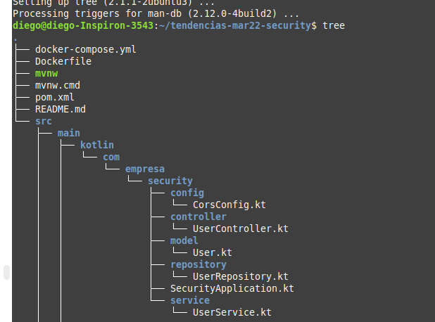
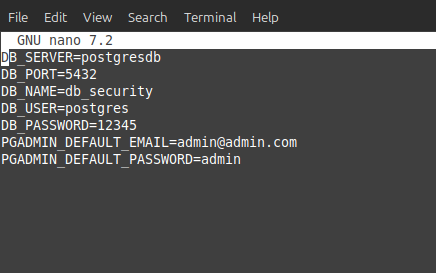
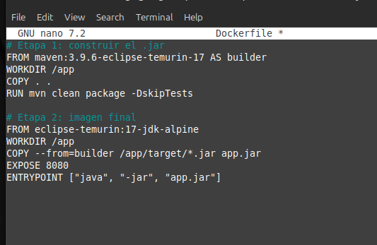
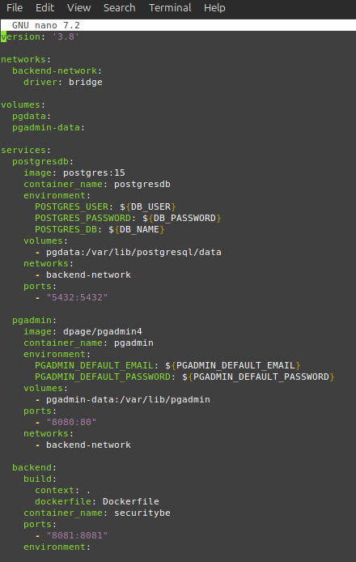
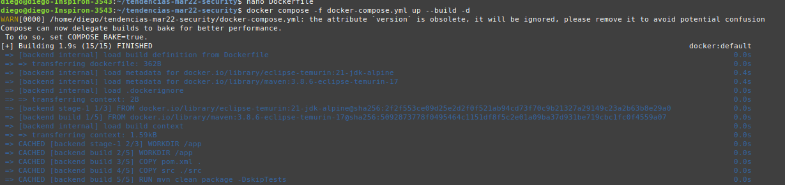
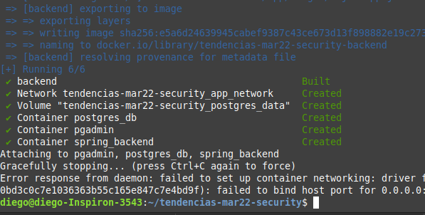
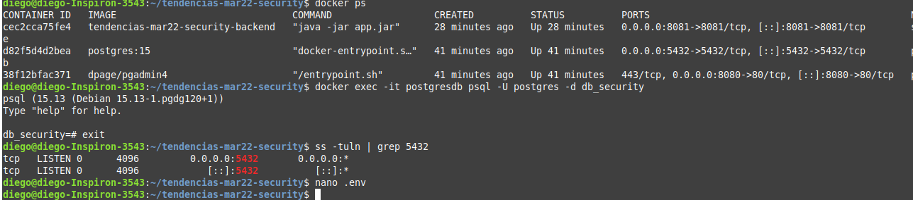
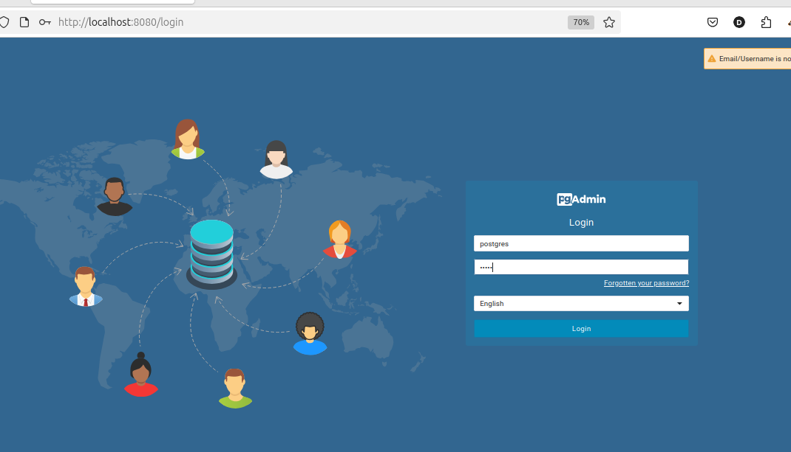
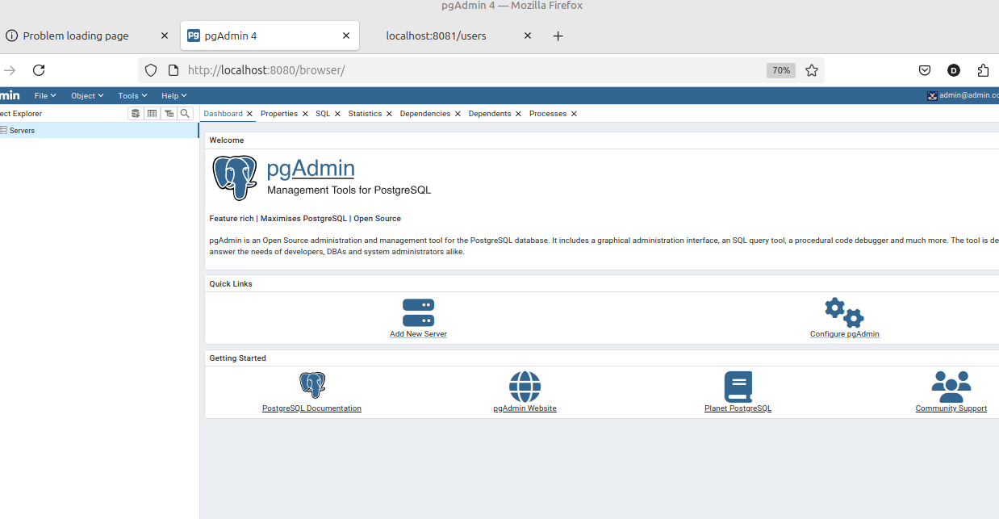
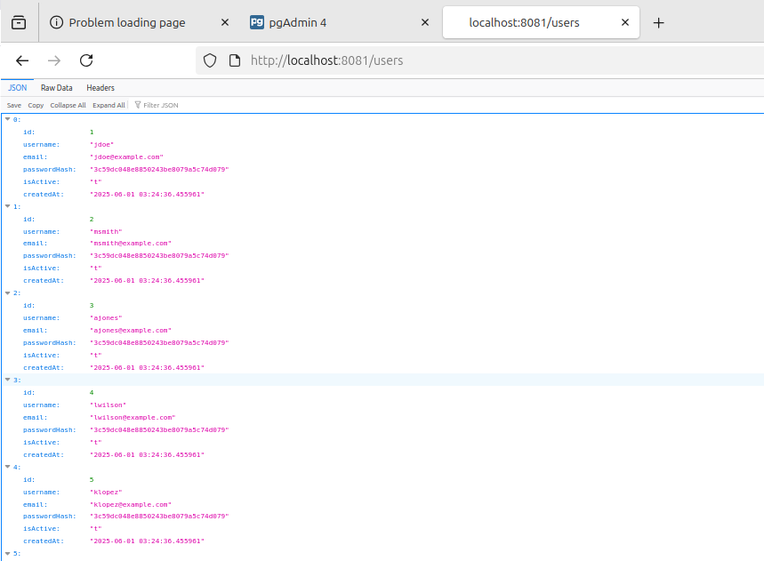

# Práctica: Semana 8
## 1. Título
**Generar una imagen Docker a partir de una aplicación React**

## 2. Tiempo de duración
**2 horas**

## 3. Fundamentos

La automatización del despliegue en el backend puede lograrse mediante herramientas como Maven con Spring Boot, que permite compilar y empaquetar tanto el backend como el frontend en un solo archivo .jar, simplificando el despliegue. Docker ofrece una alternativa robusta al empaquetar aplicaciones en contenedores, asegurando portabilidad y consistencia entre entornos. Además, plataformas como Jenkins, OctopusDeploy y Ansible permiten automatizar procesos de integración y entrega continua. Para entornos con Kubernetes, herramientas como Helm y Argo CD permiten gestionar configuraciones y sincronizar despliegues directamente desde un repositorio Git.

**Docker compose**

Docker Compose es una herramienta que permite definir y ejecutar aplicaciones con múltiples contenedores. Facilita la gestión de servicios, redes y volúmenes mediante un único archivo YAML. Con un solo comando, es posible iniciar todos los servicios definidos. Funciona en entornos de producción, desarrollo, pruebas y flujos CI. Incluye comandos para iniciar, detener y reconstruir servicios, ver su estado y transmitir registros. También permite ejecutar comandos puntuales en un servicio (Docker, s. f.).

**Dockerfile**

Un Dockerfile es un archivo de texto que contiene un conjunto de instrucciones necesarias para construir una imagen Docker. Su propósito es automatizar el proceso de creación de entornos de ejecución, definiendo paso a paso cómo debe configurarse el sistema que contendrá la aplicación. Cada instrucción en el Dockerfile crea una nueva capa dentro de la imagen resultante.

Una imagen Docker es una plantilla inmutable que contiene todo lo necesario para ejecutar una aplicación: el sistema operativo base, el servidor o entorno de ejecución, los archivos de la aplicación y sus dependencias. Las imágenes son portables, replicables y se utilizan para lanzar contenedores, que son instancias en ejecución de dichas imágenes.

**.env**

Es un archivo de texto plano que se utiliza para almacenar variables de entorno en formato CLAVE=VALOR. Estas variables son usadas por aplicaciones para configurar su comportamiento sin necesidad de modificar el código fuente.

## 4. Conocimientos previos

- Comandos básicos de Linux.
- Instalación y uso de Docker.
- Configuración de docker-compose.yml
- Conceptos claros sobre imagenes en docker y Dockerfile.
- Comprensión de APIS maven kotlin y sus archivos de configuracion.

## 5. Objetivos a alcanzar

- Levantar 3 contenedores a la vez
- Configurar las credenciales de usuario en un archivo .env
- Con un solo archivo yml Levantar todos los servicios y crear una imagen docker

## 6. Equipo necesario

- Computadora con sistema operativo Linux.
- Docker instalado con el plugin de docker compose.
- Acceso a internet.
- Navegador web para acceder al localhost.

## 7. Material de apoyo

- [Documentación oficial de Docker y Docker file](https://docs.docker.com)

## 8. Procedimiento

**Paso 1:** Clonar los repositorios e ingresar a la raíz del proyecto

```bash
git clone https://github.com/maguaman2/tendencias-mar22-security.git
cd tendencias-mar22-security
npm install
```

**Paso 2:** Crear los archivos .env, Dockerfile y docker-compose.yml

```bash
nano .env
nano docker-compose.yml
nano Dockerfile
```


**Paso 3:** En .evn configuramos las credenciales de usuarion tanto para pgadmin como para la base de datos.



**Paso 4:** En Dockefile definimos como se va a construir la imagen basada en el Backend de maven kotlin.



**Paso 5:** Configuramos el archivo docker-compose.yml con los contenedores que necesitamos, pero además va a orquestar el archivo .env para definir las credenciales de usuario y un build dentro de services para levantar la imagen del Dockerfile.



**Paso 6:** Ejecutamos el comando " docker compose -f docker-compose.yml up --build -d" para ejecutar el docker-compose.yml y empesar a construir la imagen, los contenedores y asignar las credenciales de usuario.



**Resultado:** vemos que la construcción de la imagen ha finalizado exitosamente.




**Paso 7:** Vamos al navegador y comprobamos que las rutas localhost:8080 y localhost:8081/users funcionan adecuadamente.





## 10. Bibliografía

Docker. (n.d.). Dockerfile reference. Docker Documentation. https://docs.docker.com/reference/dockerfile/

Docker Inc. (2024). *Docker Documentation*. https://docs.docker.com  

Guamán, M. (s.f.). Semana 8: Despliegue proyecto backend. Notion. https://wobbly-zephyr-621.notion.site/Semana-8-Despliegue-proyecto-backend-1f7a42399a818028b39ef841339a573f

Molnar, N. A. (2022, diciembre 19). Despliegue de aplicaciones con Docker-Compose. Adictos al trabajo. https://adictosaltrabajo.com/2022/12/19/despliegue-de-aplicaciones-con-docker-compose/

